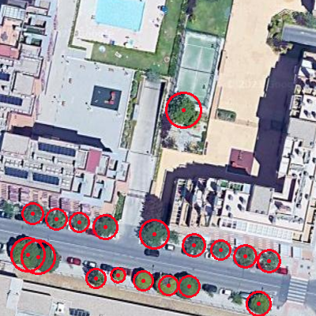

# Hi there, I'm Pablo Asensio 👋 
## I'm a Private Pilot, Aerospace Engineer and Computer Vision Architect!!

- 🛫 I will surely be organizing a new trip 🤣
- 📖 I’m currently learning everything 👨‍🎓 
- 🥅 2025 Goals: Become a Comercial Pilot.
- ⚽️ Fun fact: I love goalkeeping 🧤⚽️ 

    
  <a href="https://linkedin.com/in/asensio-pablo" target="_blank">

 

## Languages and Tools:

 
    <a href="https://github.com/PabloAsensio">
    
    

 
    
    
    
    
    
    
    
    
    

 

## Examples of Work

<a href="https://github.com/PabloAsensio/AIVA_2021-imagenes_aereas" target="_blank">
<a href="https://github.com/PabloAsensio/AIVA_2021-imagenes_aereas" target="_blank">
